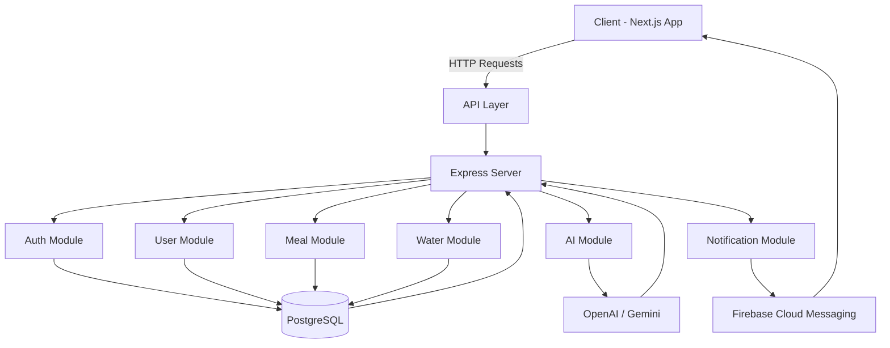

# 🥗 Fitness & Nutrition AI Tracker

A full-stack web application for tracking calories, meals, and water intake with AI-powered food analysis.

---

## 🚀 Features

### 🥗 Nutrition Tracking

* Add meals manually
* AI-based food analysis (text)
* Daily calorie tracking
* Goal tracking (on track / exceeded)

### 💧 Water Tracking

* Daily water goal (default: 8 cups)
* Add water intake
* Progress tracking
* Custom target

### 🔔 Notifications

* Smart reminders for water intake
* Daily goal alerts

---

## 🧱 Tech Stack

### Frontend

* Next.js
* React
* TailwindCSS
* Zustand

### Backend

* Node.js
* Express.js
* Prisma ORM

### Database

* PostgreSQL

### AI

* OpenAI API / Gemini

### Notifications

* Firebase Cloud Messaging

---

## 🏗️ Architecture Diagram



---

## 🧠 Architecture Explanation

### 🔹 Client Layer

* Built with Next.js
* Handles UI, state, and API calls

### 🔹 API Layer

* Central entry point (Express)
* Routes requests to modules

### 🔹 Backend Modules

* **Auth** → authentication & JWT
* **User** → profile & calorie logic
* **Meal** → food tracking
* **Water** → hydration tracking
* **AI** → food analysis
* **Notification** → reminders

### 🔹 Database

* PostgreSQL via Prisma
* Stores all persistent data

### 🔹 External Services

* AI → OpenAI / Gemini
* Notifications → Firebase

---

## 📁 Project Structure

```
fitness-app/
├── apps/
│   ├── client/
│   └── server/
├── packages/
│   ├── ui/
│   ├── types/
│   └── config/
├── prisma/
```

---

## ⚙️ Getting Started

### 1. Install pnpm

```bash
npm install -g pnpm
```

### 2. Install dependencies

```bash
pnpm install
```

### 3. Setup environment variables

Create `.env` file:

```
DATABASE_URL=
JWT_SECRET=
OPENAI_API_KEY=
```

### 4. Run development

```bash
pnpm dev
```

---

## 🗄️ Database

Using Prisma ORM with PostgreSQL.

```bash
npx prisma migrate dev
```

---

## 🤖 AI Usage

AI is used for:

* Parsing food descriptions
* Estimating calories

⚠️ AI is **NOT** the source of truth.

---

## 🚀 Deployment

### Frontend

* Vercel

### Backend

* Railway / Render

### Database

* Supabase

---

## 🧪 MVP Definition

* User can register/login
* Set calorie target
* Add meals
* Track calories
* Track water intake

---

## 📌 Future Improvements

* Image recognition
* Barcode scanning
* Health integrations
* AI recommendations

---

## 🧭 Philosophy

Build a solid system that uses AI — not an AI system that tries to be everything.
